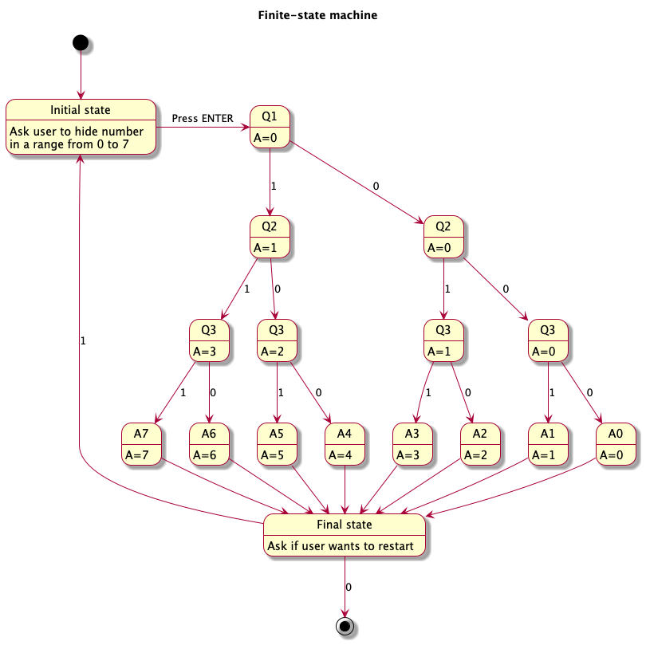

# assignment-4

## Finite-state machine

To keep things simple, we consider an example with only three questions. The underlying logic remains consistent for any number of questions.

### FSM diagram

Our system consists of five stages, which run in sequential order:
- initial stage
- three question stages
- final stage



### Truth table

We define variables:
- Input (Q1 to Q3) → T if answer for question i is Yes, else F
- Output (G0 to G7) → T if guessing that hidden number was i, else F

| Q1 | Q2 | Q3 | G0 | G1 | G2 | G3 | G4 | G5 | G6 | G7 |
|:--:|:--:|:--:|:--:|:--:|:--:|:--:|:--:|:--:|:--:|:--:|
| F  | F  | F  | T  | F  | F  | F  | F  | F  | F  | F  |
| F  | F  | T  | F  | T  | F  | F  | F  | F  | F  | F  |
| F  | T  | F  | F  | F  | T  | F  | F  | F  | F  | F  |
| F  | T  | T  | F  | F  | F  | T  | F  | F  | F  | F  |
| T  | F  | F  | F  | F  | F  | F  | T  | F  | F  | F  |
| T  | F  | T  | F  | F  | F  | F  | F  | T  | F  | F  |
| T  | T  | F  | F  | F  | F  | F  | F  | F  | T  | F  |
| T  | T  | T  | F  | F  | F  | F  | F  | F  | F  | T  |

Command:
```
g++ -std=c++17 main.cpp Game.cpp GameStates.cpp
```
